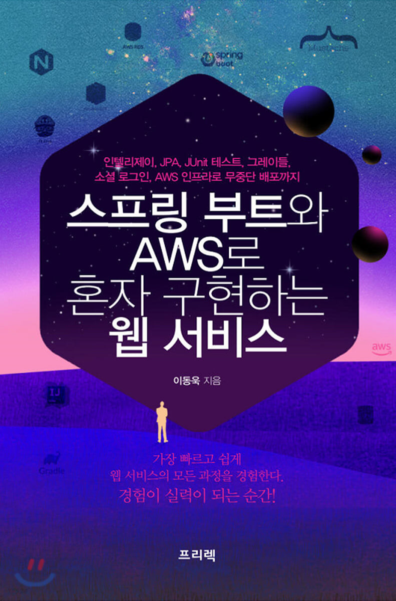

## "스프링 부트와 AWS 로 혼자 구현하는 웹서비스" 따라하기

- 이동욱님의 `스프링 부트와 AWS 로 혼자 구현하는 웹서비스` 를 보며 따라해본 코드를 저장하는 Repo 입니다.

  

---

### 게시판 구현하기 요구사항
- 게시판 기능
  - [x] 게시글 조회
  - [x] 게시글 등록
  - [x] 게시글 수정
  - [x] 게시글 삭제
- 회원 기능
  - [ ] 구글/네이버 로그인
  - [ ] 로그인한 사용자 글 작성 권한
  - [ ] 본인 작성 글에 대한 권한 관리

